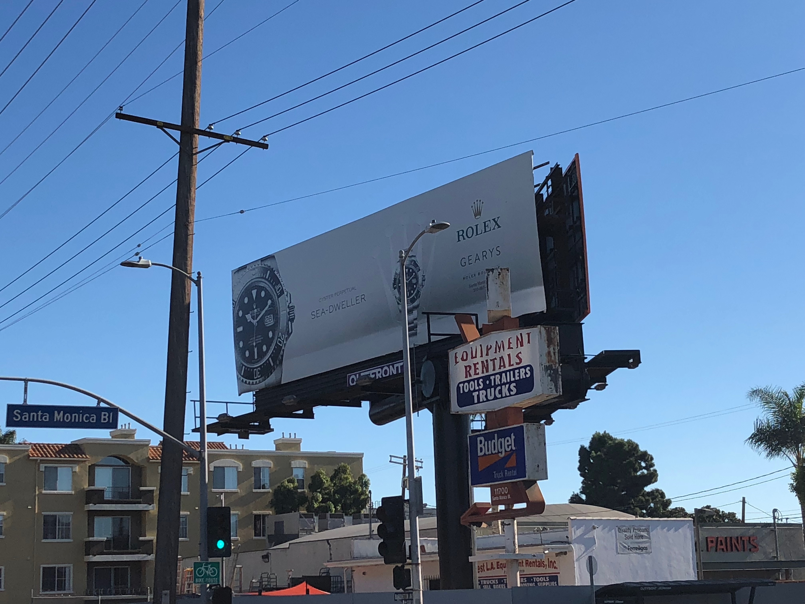
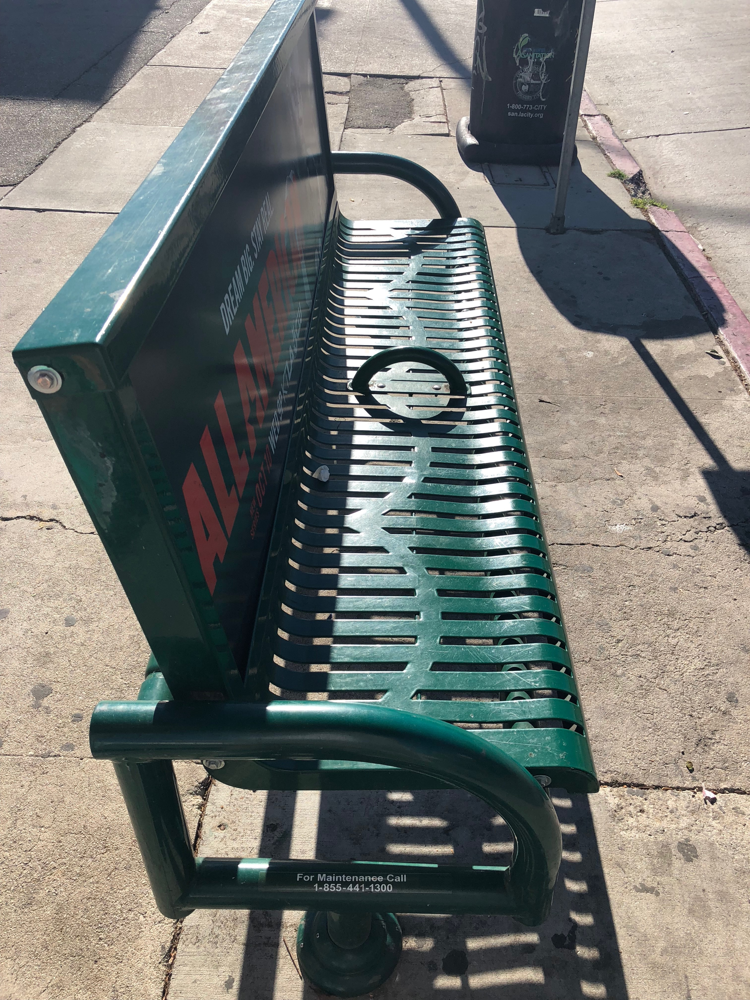
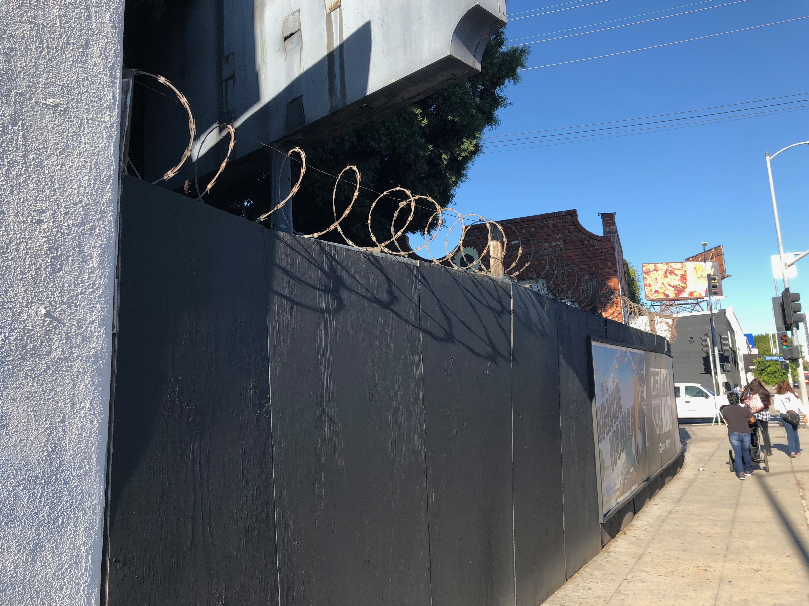
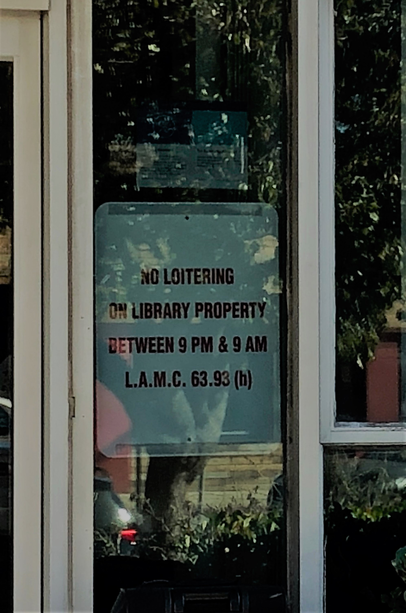

With its forward-thinking stances on issues like immigration, minimum wage, and welfare, Los Angeles stands as a monument to liberalism. This is in no small part to its diverse population who, despite their differences, united to build a progressive city that implements liberal ideas. As a native Angelino, I have seen the results of the hard work and dedication put forth many years before my time and admire the liberal monument that still stands tall today. However, during a trip across the city, I noticed cracks on the surface. Many of these cracks emanated from one location: West Los Angeles. I realized that although Los Angeles as a whole represents liberalism, West Los Angeles fails to meet the expectations of the rest of the city in regards to inclusivity, economic diversity, and addressing the homeless situation. This failure stems from a history of racial discrimination that influenced the region's current population, a high cost of living that prevents lower income residents from living in the area, and a pattern of neglecting and antagonizing the homeless. Since the 1920s, the West LA community has consisted of mostly white Americans despite the immigrant influx during the 20th century, which turned Los Angeles into a racially diverse metropolis. Similarly, while there have been efforts to create affordable housing throughout the city, West LA residents belong in the upper-middle class because the housing market favors buyers and businesses sell expensive goods. Lastly, in spite of the push to get people off the streets through humane methods such as mental health care, West Los Angeles forces the homeless to vacate the area using hostile architecture, institutions that supposedly support the homeless view transients in a negative light, and the West LA Veterans Affairs does not provide adequate service.

Despite Los Angeles’ reputation for being one of the most culturally diverse cities in America, areas like West Los Angeles are surprisingly homogeneous. African Americans, Hispanic-Americans, Asian-Americans, and white Americans all call Los Angeles home. However, much of Los Angeles is still divided by race. For example,the percentage of West LA residents who listed as white was 76.7% (“City of Los Angeles” n.d.). The overwhelmingly high white population in West LA conflicts with Los Angeles’ image as a center for racial diversity because the lack of diversity indicates that not every region in Los Angeles is fully integrated. West LA also flies in the face of institutions like UCLA’s Office of Equity, Diversity and Inclusion, which call for increased diversity and cultural representation in the city. In addition, in the 1990 and 2000 censuses, the area was still predominantly white, having a 76% white population in both years (“City of Los Angeles” n.d.). The minimal demographic change over the past 30 years shows the discrepancy between the city of Los Angeles and the West Los Angeles area. While the former welcomed more and more minorities, the latter experienced little cultural and racial integration. That most of the residents were already white likely influenced the low minority population growth into the neighborhood. Currently West LA does not live up to the ideals of diversity and inclusivity set by its parent city; however, the issues that exist today are a result of discrimination in the past.

West Los Angeles has lacked racial and cultural diversity since the early 1900s. Los Angeles was not always the multicultural hub it is today. In fact, only after World War Two during the economic boom did the minority population rise to significant numbers because Los Angeles became a center for opportunity and prosperity. Before that time, most communities were almost fully white, including West LA. For instance, “As early as the 1920s the predominantly white residents of Highland Park began looking to other areas of Los Angeles for housing. As new neighborhoods developed and transportation became more available to the west...which offered both new housing stock (humble and magnificent) and thriving commercial districts” (Schneider, 2008). West LA was initially settled by white residents of Los Angeles who capitalized on the opportunities in the area. Although Los Angeles underwent major diversification over the 20th century, West LA remained a white community because its roots were in white culture, not multiculturalism. It seems that though the times have changed, West LA has not forgotten about its history. The prevalence of white culture and a high white population in West LA was exacerbated during the “white flight” of the 1950s, 60s, and 70s. According to William Deverell (2011), after World War Two, a huge wave of poor minorities from around the country and world came to Los Angeles looking for success, specifically the South and East regions. However, the wealthy white residents of East and South LA resisted the integration of different cultures and left westward to areas like West LA. West LA, therefore, became a safe haven for white people in Los Angeles. It provided insulation from the minority cultures that flooded the East and South sectors of the Los Angeles basin. The unvarying composition of West LA contradicts Los Angeles’ image as a cultural hub and stems from the region's history as a center for white culture. Wealthy white residents made up some of West LA’s first inhabitants and wealth continues to play a factor today by segregating the community based on income.

The demographics of West LA not only conflict with Los Angeles policies of racial and cultural diversity, but also contrast policies of economic diversity. The wealth gap in Los Angeles is staggeringly high; Los Angeles ranks seventh in income inequality out of the nation’s 150 largest metropolitan areas. In order to provide adequate housing for lower-income residents, several businesses and institutions have built affordable housing in affluent neighborhoods. However, areas like West LA are still dominated by upper-middle class residents. For example, the reported median income for West LA in 2010 was $83,403. Furthermore, the percentage of those earning above $125,000 is high compared to the rest of the country (“West Los Angeles”, n.d.). The median income for the city of Los Angeles is $55,509, almost $30,000 less than that of West LA, indicating that the West LA income distribution is skewed right instead of normal. West LA does not represent the desire for an even distribution of income levels across the city because it is composed of individuals who fall under the high income brackets. Furthermore, it was also reported in the 2010 census that over 60% of West LA residents have a four-year degree and there is a high percentage of Ph.D. and master’s degree recipients in comparison to the greater Los Angeles and the nation (Flemming, 2006; “West Los Angeles”, n.d.). The prevalence of college graduates shows that many of West LA’s residents were already wealthy. With the enormous cost of higher education in America, people who decide to pursue a degree, especially post-undergraduate degrees, likely had the financial means to do so. West LA perpetuates the cycle of income inequality in the area because the descendants of the residents will have the financial stability required to attend a four-year university and achieve high paying jobs, allowing them to remain in the area. The unequal income distribution in West LA contrasts with Los Angeles policies for income equality and further segregates the community by driving up housing prices.

West LA’s uniform economic census facilitates housing discrimination because prices are adjusted for the median income level, opposing Los Angeles’s push for inclusivity. West LA is notorious for its rising housing costs. In fact, many visitors comment that a one-bedroom apartment can go as high as $3000 a month in West LA and the rates continue to increase each year. For instance, in March 2015, the median rental rate for a one-bedroom apartment in West LA was $1700 (Kudler, 2015). Two years later, the rate increased 23.5% to $2,200 (Chiland, 2017). If the trend continues, the median prices for a one-bedroom apartment could be $2700 in 2019. For low-end service workers and wage-based employees, these costs bar entry into the West LA community. Only the upper-middle class can live in the area and still have a disposable income. As a result, the workers who maintain the day-to-day business and community of West LA can’t even afford to live there. The housing market segregates lower-income individuals and contradicts the push for inclusivity in Los Angeles. Likewise, the housing prices keep West LA a homogeneous community of wealthy residents. To illustrate, the median price in West LA as of May 2018 is $1.225M and has increased 20% every prior year (Paris, 2018). In comparison, the median Los Angeles home is only just approaching $1M. While these figures reaffirm the idea that West LA is mainly composed of upper-middle class individuals, they also showcase the shortcomings of affordable housing programs. Because the median price is so high, there must be a fraction of affordable housing available. Otherwise, the median would be closer to that of the greater Los Angeles area. Therefore, calls to deal with the housing inequality in Los Angeles fall on deaf ears in West LA. The skyrocketing housing and rental rates in West LA act as a barrier for low income people but a softer deterrent lies within the local shops and advertisements in the area.

Other aspects of West LA that diverge from Los Angeles’ promotion of inclusivity are the frequency of advertisements for high class goods and expensive shops that populate the streets. In West LA, the signage is heavily populated by advertisements for popular entertainment, name brand products, and services. Likewise, expensive restaurants that offer foreign delicacies and niche boutiques that sell designer clothes litter the streets. For example, notable businesses like Rolex promote their products in West LA with large billboards that dwarf local signs, located in Figure 3. 

   {:.image}

Figure 1: A billboard promoting Rolex products that appeals to the upper class population of West LA
   {:.caption}
   
These huge signs accomplish two things: 1) increasing awareness about a company’s product, and 2) deterring visitors who can’t afford these products. The latter effect occurs because upon repeated exposure to these billboards, low income visitors to West LA will realize that the area does not cater to them. To them, the West LA neighborhood offers expensive goods and acts as an economic barrier. Thus, West LA remains economically uniform despite the movement for an even distribution of income. Furthermore, West LA is home to stores like Sushi Tsujita, where dishes can be above $45, and BLACKMARKET, where a shirt can cost $50. These pricey stores further deter low income people from visiting West LA because there are few affordable places to eat and shop at. So local business limit the inclusivity of West LA because they mostly cater to the wealthy residents. Overall, West LA is home to the wealthy, not just in terms of the residents who live there, but also in terms of the local shops and businesses who advertise in the area. Even though economic disparity is a large issue in Los Angeles, West LA does not address it. Moreover, West LA fails to address other important issues in Los Angeles, including homelessness.

Although there are rehabilitative approaches to reduce the homeless population in Los Angeles by providing affordable housing and rehabilitation centers, the West LA community uses hostile architecture to force the homeless to move to other areas. Hostile architecture refers to infrastructure and public property that is specifically made to deter transients from residing and resting in public spaces. It is often regarded as an inefficient and callous approach to dealing with homelessness.

   {:.image}

Figure 2: A bench with a partition to prevent the homeless from sleeping on it. Found in West LA.
   {:.caption}

For example, the bus stop bench shown in Figure 3 is a form of hostile architecture because the middle partition prevents the homeless from comfortably laying on the bench at night. Transients must move out of West LA to find shelter because these benches discourage the homeless from resting on them. 

   {:.image}

Figure 3: A wall with barbed wire covering the top. This image was found on Santa Monica Blvd. in West Los Angeles.
   {:.caption}

In addition, West LA harbors extreme hostile architecture, like the barbed wall depicted in Figure 5. The wall itself prevents the homeless from finding possible shelter while the barbed wire promises pain for those who try to scale the wall. Many private lots and construction sites have walls similar to this. While Los Angeles provides caring solutions to the homeless problem in the city, West LA can be unsympathetic towards its homeless population and this attitude seems to have spread to the regions public institutions.

Several West Los Angeles public institutions demonstrates hostility towards the homeless population. Because Los Angeles has one of the highest transient populations in the United States, the city council has created several governing bodies to help coordinate efforts to reduce those numbers, such as the Los Angeles Homeless Services Authority (LAHSA). Other organizations, like the Los Angeles Public Library, aid the homeless by providing resources to help the homeless improve their lives. Despite the progress, some West LA public institutions disparage the homeless or fail to provide the assistance the homeless need. 

   {:.image}

Figure 4: A sign in the West LA Public Library that targets the homeless. This image was found on Santa Monica Blvd. in West Los Angeles.
   {:.caption}

For instance, the West Los Angeles Public Library has an unfriendly view on the homeless, as shown in Figure 4 above. Although not explicitly stated by the sign, the library is warning the homeless from venturing on its grounds since the homeless are the most likely to be out during the late hours from 9PM to 9AM. The irony of the signage is that a library is a public center of learning and welcomes any member of the community unless they are homeless and seeking shelter. For example, the VA was recently involved in a scandal “misusing large chunks of its 388-acre campus in West Los Angeles and falling behind in its goal to build housing for homeless veterans. The report found 11 illegal leases [including] a City of L.A. park with a popular dog run, the Red Cross, an oil drilling operation, a parrot sanctuary and the Shakespeare Center of L.A...” (Denkmann, n.d.) The West LA VA is failing to address the homeless issue on multiple levels. First, the VA has not built enough homeless shelters, thereby endangering the homeless as the longer they are without proper care, the more likely they are to develop illnesses or worse. Second, the VA demonstrates how the homeless issue is a low priority since the VA cares more about hosting events for the settled population of West LA than it does to use its lands for those in need. In summary, some West LA public institutions have failed to address the homeless situation and as a result, many homeless veterans have been particularly affected. 

Although some organizations West LA provide help for the homeless, the local West Los Angeles Veterans Affairs center has consistently failed to provide proper care due to mismanagement. The West LA VA has been involved in controversy over the past several years. The report mentioned earlier in the essay is one of several articles detailing the VA’s failures. For example, “Nearly 300 beds and programs have been disbanded or moved off of the West Los Angeles VA campus over the last year [2018], despite the medical center’s growing budget, which currently stands at nearly $1 billion” (At L.A. VA Hospital, Toxic Culture and Mismanagement, 2018). Where the funding went is unclear, but what is clear is the VA’s inappropriate allocation of funds, which resulted in essential services being cut. The VA’s betrayal endangers its veterans, who are less likely to improve their lives without these programs and beds, both of which provided much needed stability. Likewise, the VA has made it especially challenging for some veterans to attain affordable housing. For instance, “the program says that in order to receive assistance, a veteran must be chronically ill, mentally ill, or have substance abuse problems. While all of those conditions are becoming more common as troops return from Iraq and Afghanistan..., veterans without a severe disability...are falling through the cracks of the VA system” (At L.A. VA Hospital, Toxic Culture and Mismanagement, 2018). Although the VA is helping mentally ill veterans find housing, healthy veterans are being left behind. The requirements for aid are so steep that some are left out on the streets. Consequently, many veterans are forced to relocate to other shelters, even though the VA is supposed to help them. So while most of Los Angeles provides production support to its homeless population, West Los Angeles fails on multiple levels such as hostile architecture, institutional mistreatment, and veteran care.

West Los Angeles is a liberal and progressive city, yet it fails to live up to the standards of Los Angeles. Stemming from the historical demographics of the early 1900s and the white flight of the mid to late 20th century, West Los Angeles is a homogenous community of white residents and doesn’t reflect the melting pot that Los Angeles is known as. In addition, West LA is an economically segregated community of mostly upper-middle residents class residents because of a high cost of living and high prices for local goods and food that prevent lower income residents from living in the area. Similarly, West Los Angeles fails to follow Los Angeles views on solving the homeless problem by employing hostile architecture to move the homeless from the region’s borders, through its public institutions which treat the homeless almost as second class citizens, and by misusing funds and resources which keep homeless veterans on the street without proper care. Like any artwork lacking proper care and preservation, sections of Los Angeles have deteriorated in terms of upholding the city’s liberal ideals. West LA is a physical example of this degradation. Although Los Angeles may be a monument to liberalism, it is not without its share of blemishes and cracks.

#### Works cited

{:.bibliography} 
1. At L.A. VA Hospital, Toxic Culture and Mismanagement Puts Veterans On The Street, Doctors Say. (2018, April 10). Retrieved from https://limacharlienews.com/va/los-angeles-va-toxic-for-veterans/
2. Chiland, E. (2017, December 19). Here's how much it costs to rent all across LA. Retrieved from https://la.curbed.com/2017/12/18/16792996/los-angeles-rental-prices-map-2017
3. Denkmann, L. (n.d.). 'Illegal Leases' On VA's West L.A. Campus Called Out By Watchdog - Including Brentwood School, Red Cross And A City Park. Retrieved from http://www.laist.com/2018/09/28/west_los_angeles_veterans_campus_illegal_leases.php
4. Flemming, D. (2006, March 22). Poverty, Inequality and Justice[PDF].
5. Kudler, A. G. (2015, April 08). Mapping the Cheapest and Most Expensive Places to Rent in Los Angeles Right Now. Retrieved from https://la.curbed.com/2015/4/8/9973268/mapping-the-cheapest-and-most-expensive-places-to-rent-in-los-angeles
6. Paris, E. (2018, May 29). Los Angeles' Median Home Price Nears $1 Million As Fierce Bidding Wars Continue. Retrieved from https://www.forbes.com/sites/ellenparis/2018/05/28/los-angeles-median-home-price-nears-1-million-as-fierce-bidding-wars-continue/#288aa92a1e85
7. Pfeiffer, D. (2012). Has Exurban Growth Enabled Greater Racial Equity in Neighborhood Quality? Evidence from the Los Angeles Region. Journal of Urban Affairs,34(4), 347-371. doi:10.1111/j.1467-9906.2011.00596.x
8. Racial/Ethnic Composition of Cities Los Angeles County. (n.d.). Retrieved from http://www.laalmanac.com/population/po38.php
9. Schneider, J. (2008). Escape From Los Angeles. Journal of Urban History,34(6), 995-1012. doi:10.1177/0096144208317600
10. West Los Angeles. (n.d.). Retrieved from http://maps.latimes.com/neighborhoods/neighborhood/west-los-angeles/
11. White Flight. (2016, February 17). Retrieved from https://www.kcet.org/shows/departures/white-flight
